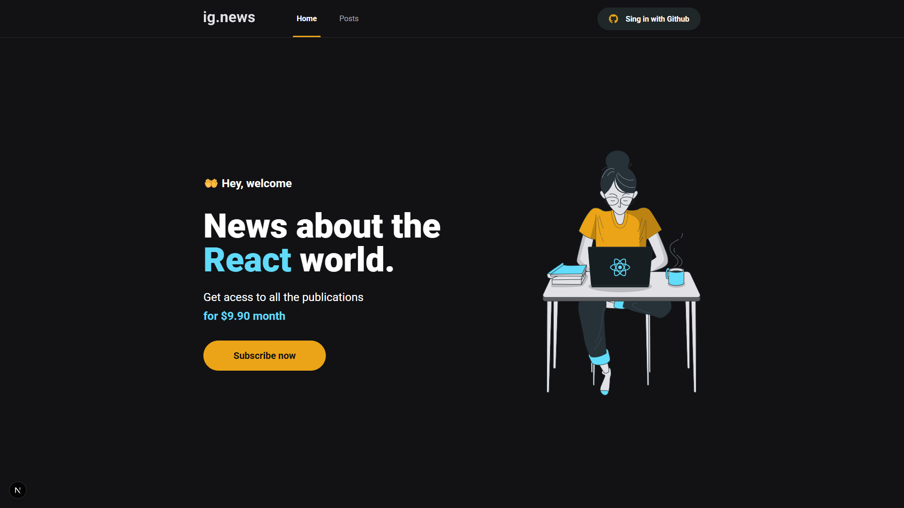
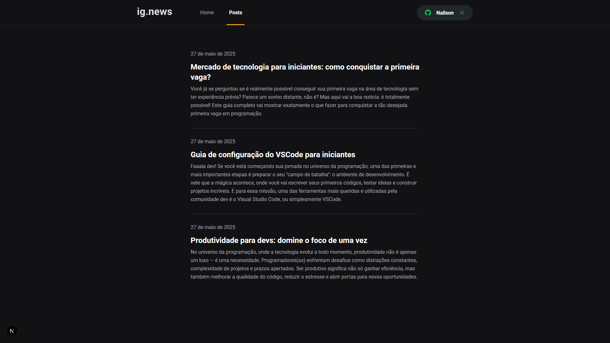
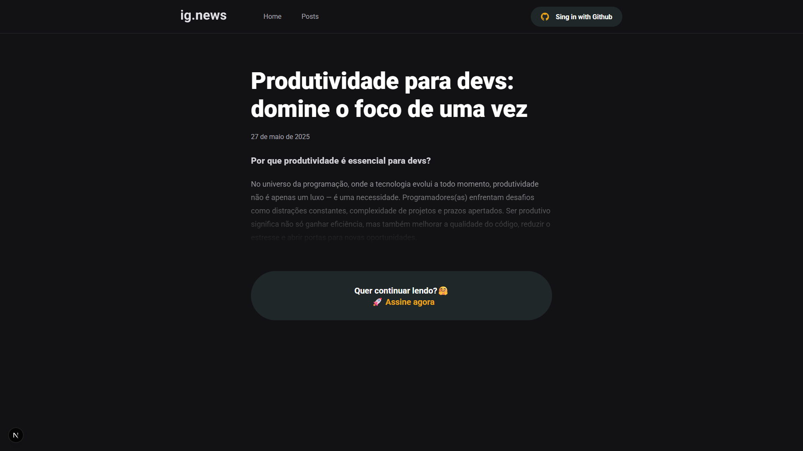
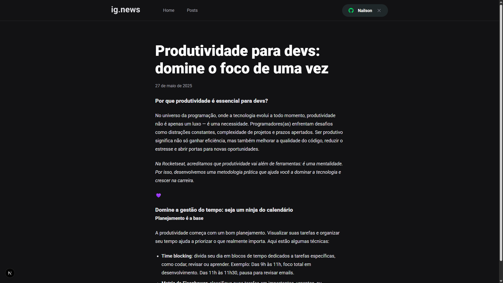

# <div align="center">🔥 Ignews</div>
<p>O <strong>Ignews</strong> é uma aplicação web para assinatura de conteúdos sobre tecnologia. Ele integra autenticação via GitHub, pagamentos via Stripe e gerenciamento de dados com Firebase. É um projeto focado em performance, escalabilidade e boas práticas de desenvolvimento moderno com Next.js 🚀


## 🚀 Tecnologias

- 🧠 [Next.js](https://nextjs.org/)
- ⚛️ [React.js](https://react.dev/)
- ☁️ [Firebase](https://firebase.google.com/)
- 💰 [Stripe](https://stripe.com/)
- 🌐 [TypeScript](https://www.typescriptlang.org/)
- 💄 [Sass](https://sass-lang.com/)
- 🔗 [NextAuth.js](https://next-auth.js.org/)


## <div align="center">🧠 Funcionalidades</div>
- Login com conta do GitHub
- Checkout de assinatura integrado com Stripe
- Validação de assinaturas ativas
- Preview de posts para não assinantes
- Acesso total aos posts para usuários assinantes
- CMS integrado via Stripe (planos e pagamentos)
- Persistência de dados no Firebase

## <div align="center">📸 Telas do projeto</div>
<p>🔸 Página inicial (deslogado)</p>  <p>🔸 Listagem de posts (logado)</p>  <p>🔸 Visualização do preview do post</p>  <p>🔸 Visualização do post completo (logado e com assinatura ativa)</p> 


## <div align="center">⚙️ Como rodar localmente</div>

````
# Clone o repositório
git clone https://github.com/nailsonlima/ignews

# Acesse a pasta do projeto
cd ignews

# Instale as dependências
npm install

# Crie um arquivo .env.local com as seguintes variáveis:
# (Configurar suas chaves do Stripe, Firebase e GitHub)

# Rode o servidor de desenvolvimento
npm run dev

# Acesse no navegador
http://localhost:3000

````

## <div align="center">🖥️ Acesse no navegador</div>
```
http://localhost:3000/

🗂️ Variáveis de ambiente (.env.local)
GITHUB_CLIENT_ID=your_client_id
GITHUB_CLIENT_SECRET=your_client_secret

STRIPE_SECRET_KEY=your_stripe_secret_key
STRIPE_PUBLIC_KEY=your_stripe_public_key
STRIPE_WEBHOOK_SECRET=your_webhook_secret

NEXT_PUBLIC_STRIPE_PUBLIC_KEY=your_stripe_public_key

FIREBASE_API_KEY=your_firebase_api_key
FIREBASE_AUTH_DOMAIN=your_project.firebaseapp.com
FIREBASE_PROJECT_ID=your_project_id
FIREBASE_STORAGE_BUCKET=your_project.appspot.com
FIREBASE_MESSAGING_SENDER_ID=your_sender_id
FIREBASE_APP_ID=your_app_id
```

🤝 Contribuição::  
Sinta-se livre para usar, sugerir melhorias ou contribuir com este projeto. Toda colaboração é bem-vinda! 🚀

👨‍💻 Autor:  
Feito com dedicação e muito café por Nailson Lima! ☕🚀

🎯 Agradecimento:  
Obrigado por acessar este projeto! 💜
🕒 Atualizado em 15/07/2025 04:01:44
🕒 Atualizado em 15/07/2025 07:32:57
🕒 Atualizado em 15/07/2025 14:48:56
🕒 Atualizado em 16/07/2025 04:00:14
🕒 Atualizado em 16/07/2025 14:49:29
🕒 Atualizado em 16/07/2025 19:01:26
🕒 Atualizado em 17/07/2025 03:59:44
🕒 Atualizado em 17/07/2025 07:32:17
🕒 Atualizado em 17/07/2025 10:43:29
🕒 Atualizado em 17/07/2025 14:49:41
🕒 Atualizado em 17/07/2025 19:01:41
